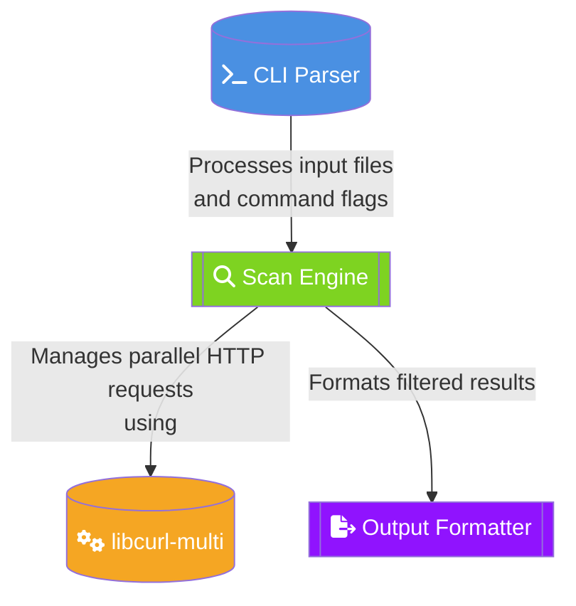

# HTTPRAF - HTTP Status Scanner 🚀

A high-performance HTTP scanner designed for cybersecurity teams. Key features:

- **Massive Parallelism**: 10K+ URLs/min via libcurl-multi
- **Smart Filtering**: Regex-based status code matching
- **SOC Integration**: JSON/CSV output formats
- **Zero-Dependency**: Single binary deployment

# Quick Start

## Download & Install
```bash
curl -sSL https://github.com/TX-One/HTTPRAF/install.sh | bash
```
## USAGE
```bash
# Basic Scan

httpraf urls.txt --2xx --output live_targets.txt

# Advanced Usage

httpraf urls.txt --201 --user-agent "Mozilla/5.0 (Red Team / HTTPRAF)" --verbose |tee -a output.txt
```

# Development Guidelines
## 🏗️ Architecture


## Security Practices
- Validate all user inputs
- Sanitize output buffers
- Implement rate limiting
- Use CSPRNG for nonce generation

