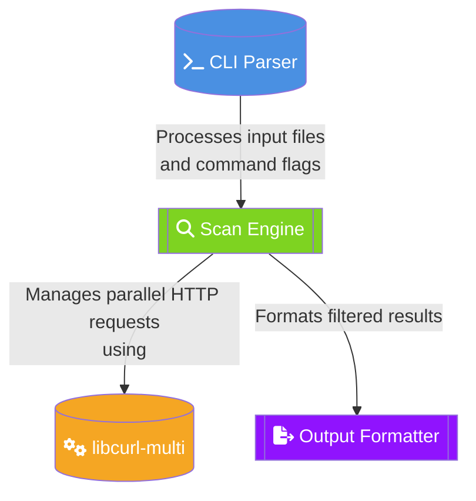

# HTTPRAF - HTTP Status Scanner 🚀

A high-performance HTTP scanner designed for cybersecurity teams. Key features:

- **Massive Parallelism**: 10K+ URLs/min via libcurl-multi
- **Smart Filtering**: Regex-based status code matching

# Quick Start
## Install Dependencies
```bash
sudo apt install libcurl4-openssl-dev
```
## Download & Install
```bash
# Clone The Repo
git clone https://github.com/TX-One/HTTPRAF.git
# Make executable
cd HTTPRAF
chmod +x httpraf
# Install globally
sudo mv httpraf /usr/local/bin/httpraf
```
## Usage
```bash
# Basic Scan

httpraf urls.txt --2xx --output live_targets.txt

# Advanced Usage

httpraf urls.txt --201 --user-agent "Mozilla/5.0 (Red Team / HTTPRAF)" --verbose |tee -a output.txt
```
## --help/--h
```bash
Usage: httpraf [input-file] [options]

Options:
  --1xx/2xx/3xx/4xx/5xx  Filter by status category
  --<code>               Filter by specific status code (e.g., --404)
  --all                  Show all responses
  --output FILE          Save results to file
  --user-agent STR       Set custom User-Agent
  --silent               Disable all non-essential output
  --verbose              Show detailed processing info

  --help                 Show this msj


DEFAULT_USER_AGENT: Mozilla/5.0 (Windows NT 10.0; Win64; x64) AppleWebKit/537.36 (KHTML, like Gecko) Chrome/91.0.4472.124 Safari/537.36 Edg/115.0.1901.203
```
# Development Guidelines
## 🏗️ Architecture


## Security Practices
- Validate all user inputs
- Sanitize output buffers
- Implement rate limiting
- Use CSPRNG for nonce generation

---

# 🤝 Contributing to the Project

🔹 Have improvements? Submit a Pull Request.

🔹 Encountered an issue? Report it in GitHub Issues.


---

# 📞 Support & Contact

📢 Have questions? Reach out through:

🔹 Telegram : https://t.me/TXpOne

🔹 GitHub Issues

---
